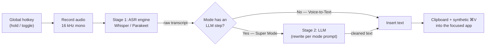

# Superwhisper, Reverse-Engineered — and a Plan to Build a Local Clone on Ollama

> **What this is.** A research teardown of how [superwhisper](https://superwhisper.com/) works, plus a concrete plan to recreate its core functionality as a **fully-local, personal-use** dictation app on macOS, using **Ollama** for the AI post-processing step.
>
> **Provenance.** The "how superwhisper works" and "prior art" sections come from a multi-source, adversarially fact-checked research pass (22 confirmed claims, 3 refuted, across 22 fetched sources). Claims are cited inline. The architecture/plan sections combine those verified findings with standard macOS/ML engineering practice — those are recommendations, not vendor facts, and are flagged where it matters. Sources are listed at the end. Current as of **mid-2026**; the open-source projects referenced are under active development and may drift.

---

## 1. TL;DR

- **Superwhisper is a two-stage pipeline, not one model.** Stage 1 is a dedicated **speech-to-text (ASR) engine** (on-device OpenAI Whisper variants + NVIDIA Parakeet). Stage 2 is an **optional language model** that rewrites the transcript according to a "mode." The two stages are architecturally distinct and independently configurable. A pure "Voice to Text" mode skips Stage 2 entirely. *(Verified — superwhisper's own docs, 3-0.)*
- **The one thing to get right:** **Ollama runs text LLMs, not Whisper.** It cannot do speech-to-text. So a clone needs a **separate ASR engine** (whisper.cpp / WhisperKit / MLX-Whisper) to produce text, and Ollama only handles the **optional cleanup/"modes"** step by consuming that text. This exact split is confirmed across *six* independent working open-source clones. *(Verified, 3-0.)*
- **This is very buildable.** Multiple open-source superwhisper clones already exist and can be studied or forked directly (VoiceInk, Overwhisper, local-whisper, FreeFlow, openless, Ollama-Transcriber).
- **Recommended shape:** menu-bar app → global hotkey → record 16 kHz mono audio → local ASR → *(optional)* Ollama modes step → insert text via clipboard + synthetic ⌘V (gated on Accessibility permission).
- **Fastest path to "working":** a ~100-line Python script (push-to-talk → MLX/whisper.cpp → Ollama → paste). **Nicest end result:** a native Swift menu-bar app with WhisperKit. Both are covered below.

---

## 2. How superwhisper actually works (verified)

### 2.1 The two-stage pipeline

Superwhisper's own documentation states it verbatim:

> "Superwhisper runs two models back to back. A speech recognition model turns your voice into text. Then an **optional** language model rewrites that text in Super Mode."
> "After transcription, AI processing shapes your text based on the mode's purpose."

Key implications, all confirmed 3-0:

- **Transcription and AI post-processing are separate, independently-selectable stages.** You pick a Voice Model and (optionally) a Language Model independently. Superwhisper even documents mixed setups like "on-device Parakeet into cloud Claude Sonnet."
- **The LLM step is optional.** A dedicated **"Voice to Text"** mode "does not include AI processing" — it's raw ASR output. This is the single most important architectural fact for a clone: *you can ship a useful product with Stage 1 alone, then add Stage 2.*



### 2.2 Stage 1 — Speech-to-text (ASR)

- Superwhisper's ASR uses **on-device OpenAI Whisper variants** in multiple size tiers, plus **NVIDIA Parakeet** models. Confirmed lineup and sizes *(3-0)*:

  | Superwhisper name | Underlying model | Size | Languages |
  |---|---|---|---|
  | Fast | Whisper tiny | 75 MB | 100+ |
  | Nano | Whisper base | 150 MB | 100+ |
  | Standard | Whisper small | 500 MB | 100+ |
  | Pro | Whisper medium | 1.5 GB | 100+ |
  | Ultra V3 Turbo | Whisper large-v3-turbo | 1.6 GB | 100+ |
  | Ultra V3 | Whisper large-v3 | 3.0 GB | 100+ |
  | Parakeet V2 | NVIDIA Parakeet (English) | 476 MB | English |
  | Parakeet V3 | NVIDIA Parakeet (multilingual) | 494 MB | 24 |

  *(The "100+ languages" is vendor rounding — real Whisper supports ~99. Sizes match known Whisper disk footprints.)*

- **Runs fully offline.** "Audio never leaves the device and no internet connection is needed"; transcription "behaves the same whether you're online or not" (works in airplane mode). *(Verified 3-0.)* Note: the *app* may still make unrelated network calls for licensing/analytics — but **no audio** is sent for local models.

### 2.3 Stage 2 — AI post-processing ("Modes")

- The **"modes"** system is where superwhisper adds value beyond raw dictation. A mode bundles: a voice model, an optional language model, and a **prompt/instruction** that shapes the output (e.g., email, message, notes, meeting summary).
- Stage 2 can run **local open-weight LLMs** — superwhisper explicitly lists on-device language models (GPT-OSS 20B, DeepSeek R1 Distill, Mistral 7B, Llama 3 8B, Phi-2) executed **"locally through llama.cpp on Apple Silicon."** *(Verified 3-0.)* **This is exactly the role Ollama plays in a clone** — a swappable local text-LLM runtime.
- Real, shippable "modes" behaviors (demonstrated by the FreeFlow clone, verified 3-0): **context-aware cleanup** (reads nearby app context so names/terms are spelled correctly), **custom vocabulary** preservation, and an **"Edit Mode"** that transforms *already-highlighted* text via a spoken instruction ("make this shorter," "turn this into bullets").

### 2.4 Feature map (what "base functionality" means)

| Feature | What it does | Clone difficulty |
|---|---|---|
| Global hotkey | Start/stop dictation from any app (push-to-talk or toggle) | Low–Med |
| Audio capture | Record mic to 16 kHz mono | Low |
| Local ASR | Whisper/Parakeet → text, offline | Low–Med |
| Optional LLM "modes" | Rewrite transcript per a prompt (Ollama) | Low |
| Text insertion | Drop result into the focused app | Med (permissions) |
| Multiple modes | Per-mode voice model + prompt + hotkey | Med |
| Custom vocabulary | Bias/fix names & jargon | Low–Med |
| VAD (hands-free) | Auto start/stop on speech | Med (optional) |

> **Two documented gaps in the research.** Superwhisper's *exact* internal VAD algorithm and its precise hotkey/recording code path are **not publicly documented** — no source confirmed them. Treat VAD and the recording internals as *your* design choices (recommendations below), not reverse-engineered facts.

---

## 3. The one thing to get right: **Ollama ≠ Whisper**

This is the crux of your request, and the research confirms it firmly *(verified 3-0 across four independent repos)*:

- **Ollama serves text LLMs.** Its llama.cpp-based runtime runs models like Llama, Mistral, Qwen, Gemma, Phi. It **does not** run Whisper's audio encoder-decoder for transcription. The community-uploaded "whisper" tags on ollama.com are **non-functional placeholders** — don't rely on them.
- **Therefore a clone needs two engines:**
  1. **ASR engine** (whisper.cpp / WhisperKit / MLX-Whisper / faster-whisper / Parakeet-via-FluidAudio) → produces the transcript.
  2. **Ollama** → consumes that transcript text and does the *optional* rewrite/cleanup ("modes").
- **How they connect:** Ollama exposes an **OpenAI-compatible endpoint** at `http://localhost:11434/v1/chat/completions`. Your app POSTs `{system prompt for the mode} + {raw transcript}` and gets back cleaned text. (openless does exactly this — "any OpenAI-compatible endpoint you bring," and Ollama fits that contract.)

```
  🎤 audio ──▶ [ ASR engine ] ──▶ "raw text" ──▶ [ Ollama LLM ] ──▶ "polished text" ──▶ paste
                (whisper.cpp etc.)   (optional)     (localhost:11434)      (optional)
```

If you skip the middle box, you have a "Voice to Text" mode. If you include it, you have "Super Mode." **Ship the ASR path first; bolt Ollama on second.**

---

## 4. Prior art: open-source clones to steal from

You do not need to invent the architecture — copy a proven one. All verified as real, working projects that use the ASR-separate-from-LLM split:

| Project | Lang | ASR | LLM step | Why it's useful to you |
|---|---|---|---|---|
| **[VoiceInk](https://github.com/Beingpax/VoiceInk)** | Swift | whisper.cpp (+ Parakeet via FluidAudio) | "Smart Modes" | GPL, ~4,400★, **native macOS reference implementation** end-to-end. The closest thing to "superwhisper, open source." |
| **[Overwhisper](https://github.com/OverseedAI/overwhisper)** | Swift | WhisperKit + Parakeet/FluidAudio | optional | Cleanest reference for the **native integration layer**: AVAudioEngine 16 kHz capture, `HotKey` global shortcuts, clipboard+⌘V insertion (source verified). |
| **[local-whisper](https://github.com/luisalima/local-whisper)** | — | whisper.cpp (GGML) | **Ollama** (default `gemma3:4b`) | The **closest match to your exact goal**: whisper.cpp + *optional* Ollama refinement, runs only on text >50 chars. |
| **[FreeFlow](https://github.com/zachlatta/freeflow)** | — | separate STT endpoint | separate LLM endpoint | Best reference for the **modes system**: context-aware cleanup, custom vocabulary, "Edit Mode." |
| **[openless](https://github.com/Open-Less/openless)** | Rust | Qwen3-ASR (bundled) | any OpenAI-compatible endpoint (→ Ollama) | Documents the **canonical pipeline wiring** verbatim (see §5). Clean module separation. |
| **[Ollama-Transcriber](https://github.com/chumphrey-cmd/Ollama-Transcriber)** | Python | Whisper | **Ollama** (summarize) | Minimal, explicit "Whisper for STT + Ollama for text" demo. |

**Recommendation:** read **VoiceInk** (for the native polish) and **local-whisper** (for the exact whisper.cpp + Ollama wiring you want), and use **openless**'s pipeline description as the blueprint.

---

## 5. Target architecture for our clone

openless documents the canonical pipeline shape almost exactly as you'd want it *(verified 3-0)*:

```
hotkey edge → Recorder.start + ASR.openSession → [audio frames]
            → hotkey edge → Recorder.stop → Polish → Insert → History.save
```

Generalized target architecture:

| Stage | Job | Recommended choice (macOS) | Verified alternatives |
|---|---|---|---|
| **Shell** | Menu-bar app, settings, mode picker | SwiftUI menu-bar app *(native)* **or** Python + `rumps` *(fast)* | — |
| **Hotkey** | Global start/stop (push-to-talk + toggle) | `KeyboardShortcuts` (Swift) or `HotKey` (Swift) / `pynput` (Python) | CGEventTap, NSEvent global monitor, RegisterEventHotKey are the 3 viable APIs |
| **Capture** | Mic → 16 kHz mono | `AVAudioEngine` (Swift) / `sounddevice` (Python) | 16 kHz mono WAV is the Whisper-native format |
| **ASR (Stage 1)** | Audio → raw text, offline | **WhisperKit** (native, CoreML/Neural Engine) or **MLX-Whisper** (Python, Apple Silicon) or **whisper.cpp** (Metal) | faster-whisper (CPU-only on Mac ⇒ slower), Parakeet via FluidAudio |
| **Modes (Stage 2)** | *Optional* rewrite of text | **Ollama** `/v1/chat/completions`, small model | llama.cpp directly, any OpenAI-compatible server |
| **Insert** | Text → focused app | `NSPasteboard` + synthetic **⌘V** via `CGEvent`, gated on `AXIsProcessTrusted` | Direct AX `kAXValueAttribute` write; clipboard-only fallback |
| **VAD (optional)** | Hands-free start/stop | Silero VAD or WebRTC VAD | — *(superwhisper's own VAD undocumented)* |

### Which implementation path?

**Path A — Python script/MVP (recommended to start).** Fastest to a working "hold key → speak → text appears" loop; trivial to wire Ollama. Best if you want it working this weekend and don't mind a slightly less polished shell.

**Path B — Native Swift menu-bar app (recommended end state).** What the real superwhisper and VoiceInk/Overwhisper are. Best latency (WhisperKit on the Neural Engine), cleanest hotkey + text-insertion integration, feels like a real product. Higher effort; needs Xcode/Swift. Fork **Overwhisper** or **VoiceInk** to skip most of the boilerplate.

> **My recommendation:** Do **Path A first** to validate the pipeline and your Ollama modes end-to-end (a day or two). If you end up using it daily and want it to feel native/fast, port to **Path B** by studying VoiceInk. Everything you learn in Path A (mode prompts, model choices, permission handling) transfers.

---

## 6. Phased build plan

### Phase 0 — Environment (½ day)
1. Install **Ollama**, pull a small cleanup model: `ollama pull llama3.2:3b` (also try `qwen2.5:3b`, `gemma3:4b`). Confirm the OpenAI endpoint works: `curl http://localhost:11434/v1/chat/completions ...`.
2. Install an **ASR engine**:
   - Python: `pip install mlx-whisper` (Apple Silicon, fast) **or** `pip install pywhispercpp` (whisper.cpp bindings, Metal).
   - Native: add **WhisperKit** via Swift Package Manager.
3. Grant permissions up front (see §9): **Microphone**, **Accessibility**, possibly **Input Monitoring**.

### Phase 1 — MVP: Voice-to-Text, no LLM (1–2 days)
Goal: hold a hotkey → speak → release → **raw** transcript pasted into the focused app.
- Global hotkey (push-to-talk) → start/stop recording.
- `sounddevice`/`AVAudioEngine` capture to 16 kHz mono.
- Run ASR → text.
- `pyperclip`/`NSPasteboard` + synthetic ⌘V to insert.
- *This alone is already a usable dictation tool.* (See Appendix A for a working Python skeleton.)

### Phase 2 — Add the Ollama "Super Mode" (½ day)
- After ASR, POST `{system prompt} + {raw transcript}` to Ollama `/v1/chat/completions`, insert the cleaned result.
- Default cleanup prompt: fix punctuation/casing, remove filler words, keep meaning. Only run when transcript length > ~40–50 chars (mirrors local-whisper) to avoid latency on short utterances.

### Phase 3 — Modes + custom vocabulary (1–2 days)
- Define modes as data: `{name, hotkey?, asr_model, llm_model?, system_prompt, vocab[]}`. (See §8.)
- Multiple hotkeys or a quick-picker to choose a mode.
- **Custom vocabulary** two ways (do both): (a) pass a Whisper `initial_prompt` biasing toward your terms at the ASR stage; (b) include a glossary in the LLM system prompt ("preserve these terms exactly: …").

### Phase 4 — Polish (ongoing, optional)
- Menu-bar UI, settings, transcript history.
- **VAD** for hands-free mode (Silero/WebRTC) so you don't have to hold a key.
- Streaming/live-preview transcription (tiny model live, final model on stop — the local-whisper trick).
- If you want it to feel native/fast: port to Swift + WhisperKit (Path B).

---

## 7. Concrete stack & first-run setup (Python MVP)

```bash
# 1. Ollama + a small, fast cleanup model
brew install ollama            # or download from ollama.com
ollama serve &                 # background server on :11434
ollama pull llama3.2:3b        # try also: qwen2.5:3b, gemma3:4b

# 2. Python deps
python3 -m venv .venv && source .venv/bin/activate
pip install mlx-whisper sounddevice numpy pynput pyperclip requests
#   Apple Silicon: mlx-whisper is fast. Alternative: pywhispercpp (whisper.cpp/Metal).
#   Avoid faster-whisper on Mac for speed — it's CPU-only here (~3x realtime vs whisper.cpp's ~10x).
```

**Verify Ollama's OpenAI-compatible endpoint** (this is the exact contract your app uses):

```bash
curl http://localhost:11434/v1/chat/completions -d '{
  "model": "llama3.2:3b",
  "messages": [
    {"role": "system", "content": "Fix punctuation and remove filler words. Output only the cleaned text."},
    {"role": "user", "content": "um so like i think we should ship it tomorrow you know"}
  ],
  "stream": false
}'
```

---

## 8. The "modes" system (with example prompts)

Model a mode as plain config. Two example modes:

```jsonc
// Mode: "Clean" (default Super Mode)
{
  "name": "Clean",
  "asr_model": "large-v3-turbo",
  "llm_model": "llama3.2:3b",
  "system_prompt": "You clean up dictated speech. Fix punctuation, capitalization, and obvious transcription errors. Remove filler words (um, uh, like, you know). Do NOT change meaning, add content, or answer questions. Output ONLY the cleaned text.",
  "vocab": ["FoldWise", "Ollama", "Anthropic"]
}

// Mode: "Voice to Text" (raw ASR, no LLM — like superwhisper's)
{
  "name": "Voice to Text",
  "asr_model": "large-v3-turbo",
  "llm_model": null,          // <- Stage 2 skipped entirely
  "system_prompt": null,
  "vocab": ["FoldWise", "Ollama"]
}
```

Other useful mode prompts:
- **Email:** "Rewrite this dictation as a clear, professional email body. Keep it concise. Output only the email text."
- **Bullets:** "Convert this dictation into a tight bulleted list. One idea per bullet. Output only the list."
- **Message:** "Rewrite as a casual, friendly chat message. Fix grammar. Output only the message."

**Custom vocabulary** (from FreeFlow's approach, verified): append to the system prompt — *"Preserve these terms exactly, correcting any misspellings toward them: FoldWise, Ollama, Anthropic."* Optionally also feed them as the Whisper `initial_prompt` so the ASR stage biases toward them before the LLM ever sees the text.

---

## 9. macOS permissions & gotchas

| Permission | Why | API |
|---|---|---|
| **Microphone** | Capture audio | Prompted on first `AVAudioEngine`/`sounddevice` use |
| **Accessibility** | Post synthetic ⌘V into other apps | `AXIsProcessTrusted()`; request via `AXIsProcessTrustedWithOptions` with `kAXTrustedCheckOptionPrompt` |
| **Input Monitoring** | *Maybe* needed for some global-key-capture APIs | **Test empirically** — see note |

- **Text insertion mechanism (verified against Overwhisper source):** set `NSPasteboard.general` string, then post a synthetic **⌘V** with `CGEvent(virtualKey: kVK_ANSI_V, keyDown:)` + `.maskCommand` to `.cghidEventTap`. **Guard on `AXIsProcessTrusted()`**; if not granted, fall back to *clipboard-only* ("text copied — paste manually"). Consider saving/restoring the user's previous clipboard contents.
- **Input Monitoring is NOT universally required.** A tempting-but-false claim ("global keyboard monitoring *requires* Input Monitoring TCC") was **refuted 0-3** in the research. Requirements differ by API (RegisterEventHotKey vs CGEventTap vs NSEvent monitor). **Test which permissions your chosen hotkey library actually needs** rather than assuming.
- **Global hotkeys work system-wide even when unfocused**, and the `KeyboardShortcuts` library specifically also fires while an `NSMenu`/menu-bar popover is open — useful for a menu-bar app. *(Verified.)*
- **Python-specific:** when using `pynput` from a terminal, the **terminal app** (or your bundled `.app`) is what needs the Accessibility/Input-Monitoring grant, not "Python" abstractly. Bundling into a real `.app` (py2app) later makes permissions stick to *your* app.
- **Code signing:** for a personal build, an ad-hoc/self-signed build is fine; you'll just re-grant permissions after rebuilds.

---

## 10. Model recommendations & hardware sizing

Assumes **Apple Silicon** (the environment is macOS). If you're on an Intel Mac, WhisperKit/MLX don't apply — use whisper.cpp (CPU) or faster-whisper, and expect slower ASR.

**ASR (Stage 1):**
- **Everyday driver:** `large-v3-turbo` (superwhisper's "Ultra V3 Turbo", ~1.6 GB) — near-real-time on Apple Silicon with whisper.cpp/WhisperKit, excellent accuracy.
- **Speed/low-RAM:** `small` (~500 MB) or `base` (~150 MB).
- **English-only, fastest:** consider **Parakeet v2** via FluidAudio.
- **Note:** whisper.cpp with Metal ≈ *~10× real-time* on modern Apple Silicon; faster-whisper is CPU-only on Mac (*~3×*). Prefer whisper.cpp / WhisperKit / MLX here.

**LLM cleanup (Stage 2, via Ollama):**
- **Default (fast):** `llama3.2:3b` or `qwen2.5:3b` (~2–3 GB) — plenty for punctuation/filler/formatting, sub-second-ish on Apple Silicon.
- **Higher quality:** `llama3.1:8b` or `qwen2.5:7b` (~5 GB).
- **local-whisper's default** is `gemma3:4b` — a reasonable middle ground.

**RAM budgeting (ASR + LLM run concurrently):**
- **16 GB Mac:** `large-v3-turbo` (1.6 GB) + a **3B** LLM (~2–3 GB) is comfortable. Avoid 20B+ models here.
- **32 GB+ Mac:** `large-v3-turbo` + an **8B** LLM is comfortable; you can experiment with larger.

**Latency expectation:** "Voice to Text" (ASR only) is fastest. "Super Mode" adds the LLM round-trip — a 3B model adds roughly a second for a short paragraph; an 8B model, a bit more. This is the tradeoff superwhisper makes too. Gate the LLM step on transcript length to keep short utterances snappy.

---

## 11. Open questions / decisions for you

These came out of the research as genuinely undecided — worth settling before/while building:

1. **Trigger model:** push-to-talk (hold), toggle (tap on/off), or hands-free **VAD**? Push-to-talk is simplest and recommended for the MVP; VAD (Silero/WebRTC) is a Phase-4 nicety. *(Superwhisper's own VAD is undocumented.)*
2. **ASR engine:** WhisperKit (native, Neural Engine) vs MLX-Whisper (Python, fast) vs whisper.cpp (portable, Metal). Pick based on Path A vs B and how much you value native latency.
3. **Custom vocabulary strategy:** ASR `initial_prompt` biasing, LLM-prompt glossary, or both. Both is most reliable.
4. **Which small Ollama model** best balances cleanup quality vs latency on *your* Mac — benchmark `llama3.2:3b` vs `gemma3:4b` vs `qwen2.5:7b` on your own dictation.
5. **Python MVP vs Swift native** as the end state (see §5). Reasonable to do A → B.

---

## 12. Appendix A — Python MVP skeleton (push-to-talk → ASR → Ollama → paste)

Illustrative, not production. Shows the full loop and where each engine plugs in. Fill in your hotkey of choice.

```python
import queue, threading, numpy as np, sounddevice as sd, requests, pyperclip
from pynput import keyboard
import mlx_whisper                      # Apple Silicon ASR (or use pywhispercpp)

SAMPLE_RATE = 16000                     # Whisper-native: 16 kHz mono
OLLAMA_URL  = "http://localhost:11434/v1/chat/completions"
CLEAN_PROMPT = ("Fix punctuation, capitalization and obvious errors. "
                "Remove filler words. Do not change meaning. Output only the cleaned text.")

frames, recording = [], False
q = queue.Queue()

def on_audio(indata, *_):               # capture callback
    if recording: q.put(indata.copy())

def transcribe(audio):                  # Stage 1: ASR (separate from Ollama!)
    r = mlx_whisper.transcribe(audio, path_or_hf_repo="mlx-community/whisper-large-v3-turbo")
    return r["text"].strip()

def polish(text, model="llama3.2:3b"):  # Stage 2: OPTIONAL Ollama cleanup
    resp = requests.post(OLLAMA_URL, json={
        "model": model, "stream": False,
        "messages": [{"role": "system", "content": CLEAN_PROMPT},
                     {"role": "user",   "content": text}]})
    return resp.json()["choices"][0]["message"]["content"].strip()

def insert(text):                       # paste into focused app
    pyperclip.copy(text)
    kb = keyboard.Controller()
    with kb.pressed(keyboard.Key.cmd):  # synthetic Cmd+V (needs Accessibility)
        kb.press('v'); kb.release('v')

def start():
    global recording, frames
    frames, recording = [], True

def stop(use_llm=True):
    global recording
    recording = False
    audio = np.concatenate([q.get() for _ in range(q.qsize())], axis=0).flatten().astype(np.float32)
    text = transcribe(audio)            # ASR always runs
    if use_llm and len(text) > 40:      # LLM only for longer text (latency)
        text = polish(text)
    insert(text)

# Push-to-talk on right-option: hold to record, release to transcribe+insert.
def on_press(k):
    if k == keyboard.Key.alt_r and not recording: start()
def on_release(k):
    if k == keyboard.Key.alt_r and recording: threading.Thread(target=stop).start()

with sd.InputStream(samplerate=SAMPLE_RATE, channels=1, callback=on_audio):
    with keyboard.Listener(on_press=on_press, on_release=on_release) as l:
        l.join()
```

## 13. Appendix B — the ASR↔Ollama boundary in one call

The whole "Ollama does text, not speech" nuance, in code: Ollama is only ever handed **already-transcribed text**.

```python
# audio -> text happens in your ASR engine (mlx_whisper / whisper.cpp / WhisperKit).
raw = transcribe(audio)               # <- Whisper. NOT Ollama.

# text -> text happens in Ollama's OpenAI-compatible endpoint.
clean = requests.post("http://localhost:11434/v1/chat/completions", json={
    "model": "llama3.2:3b",
    "messages": [
        {"role": "system", "content": "<the current mode's prompt>"},
        {"role": "user",   "content": raw},   # <- Ollama sees TEXT, never audio
    ],
    "stream": False,
}).json()["choices"][0]["message"]["content"]
```

---

## 14. Sources

**Primary — superwhisper (how the product works):**
- superwhisper models & pipeline — https://superwhisper.com/models
- superwhisper modes docs — https://superwhisper.com/docs/modes/modes
- superwhisper "Voice to Text" mode — https://superwhisper.com/docs/modes/voice
- superwhisper offline transcription — https://superwhisper.com/offline-transcription

**Primary — open-source clones (architecture to copy):**
- VoiceInk (Swift, whisper.cpp) — https://github.com/Beingpax/VoiceInk
- Overwhisper (Swift, WhisperKit, verified source for capture/hotkey/insert) — https://github.com/OverseedAI/overwhisper
- local-whisper (whisper.cpp + Ollama) — https://github.com/luisalima/local-whisper
- FreeFlow (modes, context-aware cleanup, custom vocab, Edit Mode) — https://github.com/zachlatta/freeflow
- openless (Rust, canonical pipeline wiring, OpenAI-compatible polish) — https://github.com/Open-Less/openless
- Ollama-Transcriber (Whisper + Ollama) — https://github.com/chumphrey-cmd/Ollama-Transcriber

**Primary — macOS integration:**
- Apple DTS on global key monitoring APIs — https://developer.apple.com/forums/thread/735223
- sindresorhus/KeyboardShortcuts (global hotkey library) — https://github.com/sindresorhus/KeyboardShortcuts

**Secondary — reviews / benchmarks (corroborating):**
- superwhisper model review — https://spokenly.app/blog/superwhisper-review
- Parakeet vs Whisper — https://spokenly.app/blog/parakeet-vs-whisper
- Local Whisper on Apple Silicon (whisper.cpp Metal vs faster-whisper CPU) — https://www.promptquorum.com/power-local-llm/local-whisper-stt-comparison-2026
- Whisper + Ollama local voice stack (Apple Silicon) — https://dev.to/xadenai/building-a-local-voice-ai-stack-whisper-ollama-kokoro-tts-on-apple-silicon-eo0

**Refuted claims (deliberately excluded — don't design around these):**
- ❌ "Global keyboard monitoring *requires* Input Monitoring TCC permission" — refuted 0-3; test per-API instead.
- ❌ "Apple recommends CGEventTap specifically because of paired permission APIs" — refuted 1-2.
- ❌ "VoiceInk's LLM backend is undocumented" — refuted 1-2.

---

*Research method: 5-angle fan-out web search → 22 sources fetched → 109 candidate claims → 25 verified via 3-vote adversarial checking (2/3 refutes to kill) → 22 confirmed, 3 refuted → synthesized. Architecture/plan sections extend those verified findings with standard macOS/ML engineering practice.*
